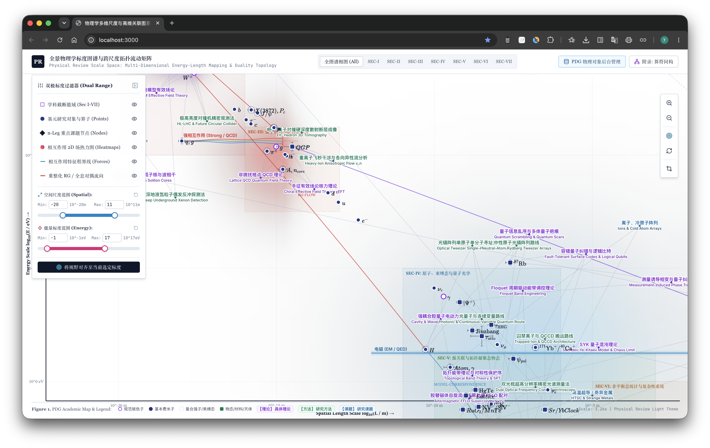

# 全景物理学标度图谱与跨尺度拓扑流动矩阵
> **Physical Review Scale Space: Multi-Dimensional Energy-Length Mapping & Duality Topology**

[](https://hy-iu.github.io/orderlevelredro/)
[](LICENSE)

一个基于 WebGL / HTML5 Canvas 的互动式物理学全能标（长度标度 $L$ vs 能量标度 $E$）相图与拓扑流动映射图谱，旨在可视化从微观基本粒子（高能 HEP）、凝聚态/量子材料、原子分子（AMO）到天体与宇宙学（GR & Cosmology）的跨尺度物理对象、量子相变与有效场论（EFT）对偶关系。



---

## 🌐 在线体验 (Live Demo)

访问部署在 GitHub Pages 的交互式体验页面：
👉 **[https://hy-iu.github.io/orderlevelredro/](https://hy-iu.github.io/orderlevelredro/)**

---

## ✨ 核心特性 (Key Features)

1. **双轴物理标度二维相空间 (2D Phase Space Canvas)**
   - **X 轴 (长度标度)**：$\log_{10}(L/\text{m}) \in [-36, 27]$（从普朗克长度到可观测宇宙半径）
   - **Y 轴 (能量标度)**：$\log_{10}(E/\text{eV}) \in [-5, 29]$（从宇宙微波背景辐射到普朗克能量）
   - 支持 Canvas 平移（Pan）、滚轮自由缩放（Zoom）与矩形框选缩放（Box Zoom）。

2. **多层级矢量算符与真实 LaTeX 渲染 (KaTeX & `\ce{}` Chemistry Support)**
   - 粒子、材料与重对偶节点内置精细的 KaTeX 公式与 `\ce{}` 化学式渲染。
   - 所有粒子/拓扑态节点采用期刊轻量学术风格（Light Academic Paper Theme），中文与英文分行呈现。

3. **n-Leg 跨尺度理论/方法节点与对偶关系 (Multi-Leg Research Nodes)**
   - 标注高温超导（HTSC/YBCO）、魔角双层石墨烯（MA-TBG）、拓扑绝缘体、量子计算路线（Transmon、离子阱、中性原子、光子、拓扑量子）等前沿课题。
   - 曲线连接多脚关联对象（n-Leg Bound Physical States）。

4. **附录：相互作用 2D 热场与算符同构矩阵 (Isomorphism Appendix)**
   - 内置引力相加律、电磁 Debye 屏蔽、QCD 渐进自由、EW 弱作用截断的 2D 热场推导与 Python 验证源码。
   - 提供微观波动算符到弯曲时空声学黑洞的跨标度算符同构字典（EFT Matrix）。

---

## 🛠️ 本地开发与运行 (Local Development)

### 1. 克隆仓库与安装依赖
```bash
git clone https://github.com/hy-iu/orderlevelredro.git
cd orderlevelredro
npm install
```

### 2. 启动本地开发服务器
```bash
npm run dev
```
在浏览器中打开 `http://localhost:3000` 即可实时预览。

### 3. 构建与部署到 GitHub Pages
```bash
# 构建生产环境代码
npm run build

# 一键部署到 GitHub Pages (gh-pages 分支)
npm run deploy
```

---

## 📜 许可证 (License)

本项目采用 [MIT License](LICENSE) 开源许可。
